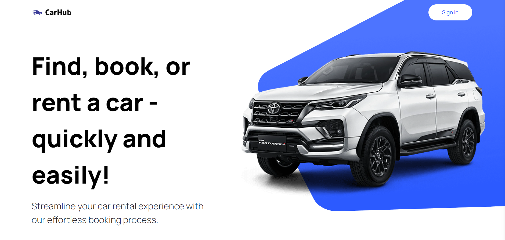
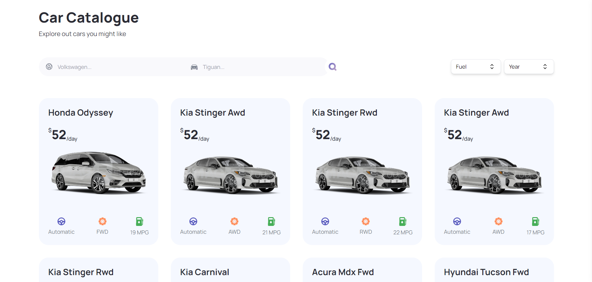
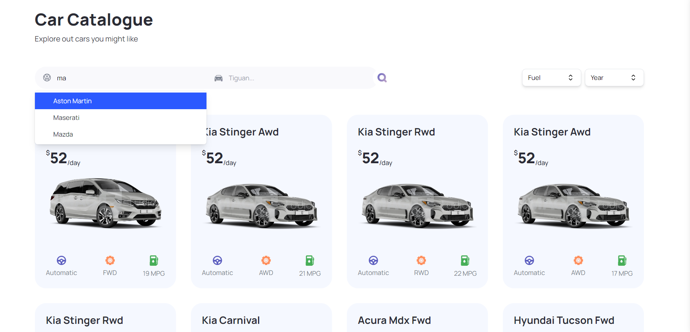
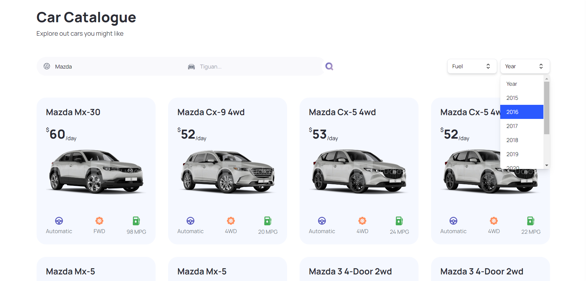
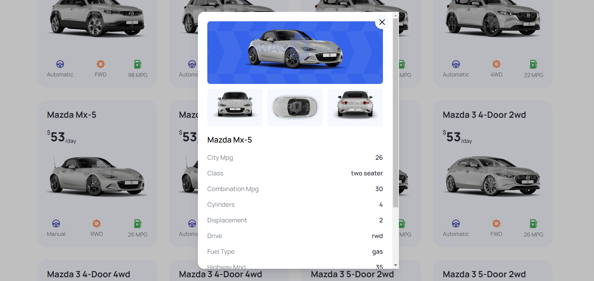
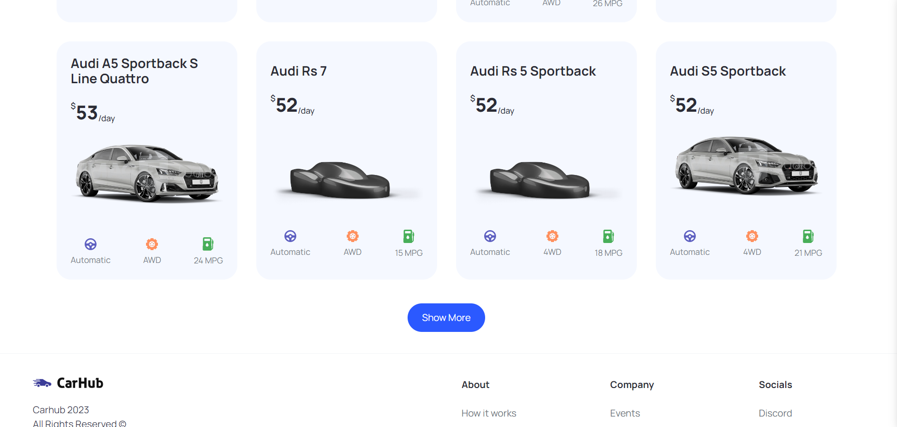

## 🤖 Introduction
Developed with Next.js and leveraging its server-side rendering capabilities, the Car Showcase website presents various car types, showcasing comprehensive information in a well-designed format with advanced filtering and pagination support for an enhanced user experience.

## ⚙️ Tech Stack
- Next.js
- TypeScript
- Tailwind CSS

## 🔋 Features
👉 Home Page: Showcases a visually appealing display of cars fetched from a third-party API, providing a captivating introduction to the diverse range of vehicles available.

👉 Exploration and Filtering: Explore a wide variety of cars from around the world, utilizing a search and filter system based on criteria such as model, manufacturer, year, fuel type, and make.

👉 Transition to Server-Side Rendering: A seamless transition from client-side rendering to server-side rendering, enhancing performance and providing a smoother browsing experience.

👉 Pagination: For easy navigation through a large dataset of cars, allowing users to explore multiple pages effortlessly.

👉 Metadata Optimization and SEO: Optimize metadata for car listing, enhancing search engine optimization (SEO) and ensuring better visibility on search engine results pages.

👉 TypeScript Types: Utilize TypeScript to provide robust typing for enhanced code quality and better development

👉 Responsive Website Design: The website is designed to be visually pleasing and responsive, ensuring an optimal user experience across various devices.

and many more, including code architecture and reusability

## Deployed Application
The application is deployed on Vercel
Link- https://car-showcase-application-five.vercel.app/

## Preview of the application

Home Page of the Application

Car Catalouge

Search bar to search your favourite cars

Custom filters to select the year or the type of car

Complete Car Details shown in a card

Show more button to incorporate pagination